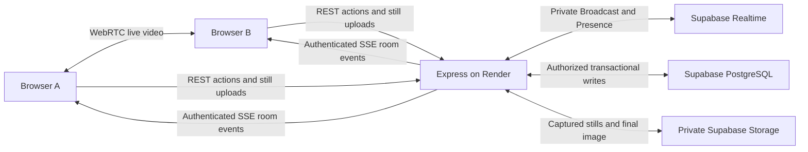

# Booth Together

Booth Together extends Pitik Booth with anonymous, live rooms for two, three, or four people. The existing Solo Booth remains available. A room coordinates local camera captures, individual reviews and retakes, multiple rounds, and one shared final image.

## Setup

1. In the Supabase SQL Editor, run `supabase/migration.sql` if the Solo Booth schema is not installed yet.
2. Run **`supabase/booth-together.sql`**. This creates the room tables, server-only transactional functions, and private `room-photos` storage bucket. Keep the original `photobooth-images` bucket for final images.
3. Confirm Supabase Realtime is enabled for the project. Use private channels; this implementation does not require public Broadcast/Presence policies or adding room tables to a Postgres Changes publication.
4. Keep `SUPABASE_URL` and `SUPABASE_SERVICE_ROLE_KEY` in `backend/.env` locally, or Render's environment in production. Keep `FRONTEND_URL` set to the frontend origin.
5. Copy the applicable settings from `frontend/.env.example` into `frontend/.env`. Configure TURN before testing across restrictive networks.
6. Run from the repository root:

   ```powershell
   npm.cmd ci
   npm.cmd run dev
   ```

Open `http://localhost:5173/together`. No new npm package is required for this update: React, Supabase's server SDK, Express, QR generation, image processing, and test dependencies are already part of the workspace. WebRTC uses browser APIs.

## How data moves



Each browser maintains a streaming `fetch` connection to `/api/rooms/:roomCode/events`. Express checks that participant's room credentials and connects to a **private Supabase Realtime channel** on their behalf. Presence membership is tied to those subscribed connections. Validated signaling messages and room updates pass through Supabase Broadcast and back to the browsers over SSE. This uses real Supabase Presence and Broadcast while keeping the service role key entirely on the server.

The browser sends offers, answers, ICE candidates, and camera status through the room signal API. Express establishes the sender identity from credentials. WebRTC then sends video directly between peers, or through the configured TURN relay when a direct route is unavailable. Live video is never uploaded to Storage, recorded, or sent over SSE.

Room commands, approvals, capture revisions, and membership persist in PostgreSQL. A snapshot is fetched when entering or reconnecting; updates are pushed thereafter. Heartbeat requests maintain liveness without polling the database for room state every second. Reconnecting clients recover the saved round and previous images.

There is no browser Supabase client, frontend Supabase anonymous key, Supabase user session, login, or registration. Do not add broad anonymous policies to make a failed private subscription work. Supabase's [Realtime authorization documentation](https://supabase.com/docs/guides/realtime/authorization) and [project settings](https://supabase.com/docs/guides/realtime/settings) describe private channels and the option to disable public channels project-wide.

## Environment variables

### Frontend: local Vite or Vercel build settings

| Variable | Purpose |
| --- | --- |
| `VITE_API_URL` | Express origin, such as `http://localhost:5000` or your HTTPS Render URL. No `/api` suffix. |
| `VITE_STUN_URL` | Comma-separated STUN URLs. Defaults to `stun:stun.l.google.com:19302`. |
| `VITE_TURN_URL` | Comma-separated `turn:` or `turns:` relay URLs. Empty disables TURN. |
| `VITE_TURN_USERNAME` | Username for the configured TURN relay. |
| `VITE_TURN_CREDENTIAL` | Credential for the configured TURN relay. |
| `VITE_DEBUG_WEBRTC` | Optional `true` for connection diagnostics during testing. Leave `false` in normal use. |

All `VITE_` variables are compiled into publicly downloadable JavaScript. This includes static TURN usernames and credentials. Use dedicated, limited relay credentials with quotas and rotation; never put a TURN provider's management key or Supabase service key here. A production service can extend Express to mint short-lived TURN credentials from a server-only secret; that credential-minting endpoint is not part of this implementation. See [Vite's environment variable guidance](https://vite.dev/guide/env-and-mode).

### Backend: local Node or Render

| Variable | Purpose |
| --- | --- |
| `PORT` | Local default `5000`; Render supplies its own port. |
| `FRONTEND_URL` | Exact frontend origin used by CORS and generated invitations/share links. |
| `SUPABASE_URL` | Supabase project URL. |
| `SUPABASE_SERVICE_ROLE_KEY` | Server-only database, storage, and private Realtime capability. |
| `PHOTO_RETENTION_DAYS` | Existing retention policy for saved final images; default example is `7`. |

Booth Together adds no required backend environment variable. Rooms expire two hours after creation. Retention for their final saved photobooth follows the existing photo policy.

## TURN for production

STUN helps peers discover possible direct paths. TURN provides a relay path when NAT or firewall behavior prevents a direct connection. A successful localhost test or same-Wi-Fi test does not establish that two people on different mobile carriers can connect. The [WebRTC connectivity documentation](https://developer.mozilla.org/en-US/docs/Web/API/WebRTC_API/Connectivity) explains ICE candidate types and relay candidates.

1. Provision a TURN service you control or a managed relay service. Obtain **relay** credentials, not an account administration key.
2. Configure the URLs that service actually supports. Typical forms are:

   ```dotenv
   VITE_STUN_URL=stun:stun.l.google.com:19302
   VITE_TURN_URL=turn:YOUR-TURN-HOST:3478?transport=udp,turns:YOUR-TURN-HOST:5349?transport=tcp
   VITE_TURN_USERNAME=YOUR-LIMITED-RELAY-USERNAME
   VITE_TURN_CREDENTIAL=YOUR-LIMITED-RELAY-CREDENTIAL
   ```

3. For a self-hosted relay, configure its public address, TLS certificate for `turns:`, listening ports, relay port range, firewall access, bandwidth limits, and credential rotation according to that server's documentation. Port numbers above are examples; use your provider's assigned values. A TCP/TLS relay endpoint on a permitted port can help with restrictive networks.
4. Redeploy Vercel after changing the frontend variables.
5. Test one device on home Wi-Fi and another on mobile data. Test a restrictive network where possible. Inspect `chrome://webrtc-internals` in Chromium or `about:webrtc` in Firefox to confirm the selected ICE pair. A relay test should show `relay` candidates and received video bytes increasing.
6. Verify camera switching, connection recovery, capture, and downloading as part of that test.

Production TURN connectivity must be verified with the actual relay and real devices. The repository cannot provision a TURN account or prove a relay works using empty credentials.

## Room behavior and access

- Creating a room asks for a display name, photo rounds, frame, layout, countdown, capacity, and automatic continuation. Photo counts use the existing choices `1, 2, 3, 4, 6, 8, 9`; capacity is `2–4`.
- The invite contains a random room code and invitation token. Share the provided invitation link or its QR code. A code-only join is also supported by the rate-limited join API; a code is an invitation capability, not a login.
- The browser keeps a generated participant UUID, display name, room code, and temporary room credentials in `sessionStorage`. Refreshing the same tab preserves membership. Clearing session storage loses that participant capability. Use the original tab to reconnect.
- Each participant receives a separate secret room capability. Knowing another participant's UUID does not permit uploading or approving as them. Stored credentials are hashed; a separate host token gates host commands. Do not publish host tokens or browser storage dumps.
- Room state, participant state, and capture revisions are separate. The backend validates ready state, current round, capture identity, image type/size, capacity, room expiry, and host actions. Transactional database operations serialize competing changes.
- Everyone must have an enabled camera and be ready before the host starts. At least two participants are required. Layout choices adapt to the roster; they include ten Duo, five Trio, and five Squad designs.
- Countdown uses one server-scheduled timestamp. Clients take five time samples, use the sample with the smallest round-trip delay, and refresh clock offset every minute and when a tab becomes visible. Each client captures its own local camera, with the preview's mirror setting applied.
- Keep the room tab visible during capture. A device that is hidden or more than two seconds late asks for a retake instead of silently submitting an unrelated late frame.
- Each still uploads separately as PNG/JPEG, with a 10 MB limit. A failed upload can retry its existing still. Individual retakes affect only that participant; the host can retake everyone. Accepted photos are required before advancing.
- Automatic continuation schedules another round after approval. With automatic continuation off, the host starts the next photo. If the host disconnects, room progress pauses while waiting for recovery.
- Presence updates immediately when Realtime observes a connection change. Persisted heartbeat liveness has a grace period. A host stale for roughly 60 seconds can be replaced by the earliest eligible connected participant through a server-validated host claim. The new host receives their own host capability.
- Temporary disconnects preserve images. The host can wait or remove a disconnected participant after the grace period. Room capacity remains limited to four because live video uses a mesh of peer connections.
- The host renders the final approved stills with the existing Canvas engine and saves one final image. Every participant receives the same final photo ID and moves to `/photo/:id`. That page supports PNG/JPG download, native sharing or copy fallback, and QR sharing.

## API map

Implementation is in `backend/src/routes/rooms.js` and the room services; the frontend contract is in `frontend/src/services/roomApi.js`.

| Endpoint | Purpose |
| --- | --- |
| `GET /api/time` | Current server timestamp; response is not cached. |
| `POST /api/rooms` | Create anonymous room and host capability. |
| `GET /api/rooms/:code/info` | Minimal room information before joining. |
| `POST /api/rooms/:code/join` | Validate invitation/capacity/expiry and issue participant credentials. |
| `GET /api/rooms/:code` | Authorized snapshot. |
| `GET /api/rooms/:code/events` | Authorized streaming SSE events relayed from private Realtime. |
| `POST /api/rooms/:code/signals` | Validated targeted WebRTC messages. |
| `POST /api/rooms/:code/actions` | Ready, heartbeat, configure, start, captured, accept, retake, next, leave, remove, end, host claim, and generation retry commands. |
| `POST /api/rooms/:code/photos` | Multipart captured still with round/capture identity. |
| `POST /api/rooms/:code/result` | Host-only final image upload. |

Protected calls use `Authorization: Bearer <participantToken>` and `X-Participant-Id`; host calls also send `X-Host-Token`. SSE uses `fetch` so credentials stay in headers instead of query strings. Room photo reads remain protected. Only the saved final image uses the existing public, unguessable photo share route.

## Development verification

Run the existing checks from the repository root:

```powershell
npm.cmd test
npm.cmd run build
npm.cmd run test:browser
```

The checked-in Playwright configuration uses Edge with a fake camera. Automated fake-camera tests verify browser logic and local media transport; they do not prove physical cameras, Supabase credentials, production SSE routing, TURN, or cross-network behavior. See the test output for precisely which scenarios were executed.

### Two browsers on one computer

1. Finish the migration and start both local services with `npm.cmd run dev`.
2. Open one normal browser profile at `http://localhost:5173` and create a two-person room with two rounds.
3. Open the invite in another browser profile, private window, or second browser. Enter a different name. Independent profiles avoid sharing room storage accidentally.
4. Allow the camera in both. Some physical camera drivers cannot serve two browsers at once; use the automated fake-camera setup for local development in that case.
5. Verify both live video cards, both ready states, synchronized countdown, uploaded photos, individual review, a retake, and the next round.
6. Verify both clients open exactly the same `/photo/:id`, then download PNG and JPG and scan/open its QR link.
7. Repeat with three/four independent contexts for the Trio/Squad designs.

### Two phones or computers

Use the deployed **HTTPS** Vercel URL. A raw LAN address such as `http://192.168.x.x:5173` does not provide the secure context required by cameras on phones. Localhost is a special development exception for the device running the browser.

1. Put person A on Wi-Fi and person B on mobile data or another Wi-Fi connection.
2. Create the room, open the complete invitation link, and allow both cameras.
3. Confirm moving live pictures in both directions before pressing Ready.
4. Complete all rounds, including an individual retake, and compare the final shared photo IDs.
5. Download both formats on iOS/Android where applicable. Exercise native sharing and QR scanning.
6. Leave and rejoin from the same tab, toggle airplane mode briefly, switch cameras, and return from a background tab. Confirm recovery or a clear retake instruction.
7. Disconnect the host long enough to test the host recovery/transfer behavior. Do not treat a same-network success as a production TURN test.

## Render and Vercel

See [DEPLOYMENT.md](DEPLOYMENT.md) for the base deployment. Keep the Express service running on Render and serve the static frontend from Vercel. API and SSE requests go directly to Render through `VITE_API_URL`; they are not Vercel serverless functions. Render documents support for [long-lived SSE connections in web services](https://render.com/tutorials/web-service-vs-static-site/web-services).

Allow streaming responses to remain unbuffered. The events endpoint uses `Content-Type: text/event-stream`, no-cache headers, and periodic keepalive comments. Do not add a proxy/CDN rule that caches, buffers, or compresses the entire event stream before delivering it. Deploying/restarting the backend interrupts SSE; clients reconnect and restore a snapshot.

Set Render's `FRONTEND_URL` to the exact Vercel production origin. CORS must permit `Authorization`, `X-Participant-Id`, `X-Host-Token`, `Content-Type`, and the existing `X-Session-Id` header. The application config handles this. Do not replace it with blanket origin access. If a preview deployment needs cloud room access, configure its actual origin deliberately.

Vercel must have `VITE_API_URL` plus applicable ICE configuration before building. Redeploy after changing them. Keep the SPA rewrite so invite links `/room/:roomCode`, `/together/create`, `/together/join`, and final links `/photo/:id` survive a direct browser refresh. [Vercel's Vite documentation](https://vercel.com/docs/frameworks/frontend/vite) covers framework build settings.

Run `npm.cmd run cleanup -w backend` periodically in a trusted environment with backend credentials. The cleanup removes expired room stills and room records, while final saved photos retain their separate expiration policy. API expiry checks reject an expired room even before its storage has been physically cleaned up. Schedule this command using infrastructure you manage; no cloud scheduler is provisioned by the source code.

## Troubleshooting

| Symptom | Check |
| --- | --- |
| Room creation says setup is incomplete | Run `supabase/booth-together.sql` after the original migration in the same Supabase project used by Render. |
| Solo Booth works but room events fail | Check private Realtime subscription errors in Render logs, project Realtime settings, outbound Supabase connectivity, and the server key. Do not add anonymous policies. |
| Room updates appear only after refresh | Inspect the events request for a continuously open `200` response and keepalives; check proxy buffering and CORS. |
| API URL is still localhost after deployment | Correct `VITE_API_URL` in Vercel and redeploy the frontend. Local `.env` does not configure Vercel. |
| CORS/preflight errors | Match Render's `FRONTEND_URL` to the page's exact HTTPS origin and verify permitted credential headers. |
| Camera is denied or unavailable | Allow browser/OS permission, use HTTPS, close other camera apps, and select Retry camera. |
| Own camera works; remote camera stays connecting | Check signaling connection first, then ICE/TURN URLs, relay credentials, firewall, TLS, and relay quotas. |
| Works on Wi-Fi but not mobile data | Configure and verify a working TURN relay; inspect the selected ICE candidate pair. |
| Video does not autoplay on a phone | Keep the room visible, interact with the page, and use the displayed video controls/retry path. Video elements use inline playback. |
| Countdown was missed | Keep the tab foregrounded, restore connectivity/clock sync, and request an individual retake. |
| Upload failed | Retry that still; check the 10 MB PNG/JPEG limit, room expiry, Storage permissions, and the capture revision. |
| Old photo rejected after retake | The old capture revision is intentionally stale; capture and upload the current retake. |
| Host disconnected | Reopen the original host tab; after the grace period, the earliest eligible participant can receive host control. |
| Refresh lost membership | Use the original tab/sessionStorage; clearing storage or using another profile requires joining again. |
| Final image cannot be generated | Ensure every required still is approved and loaded, the host is connected, and the upload fits the image limit. Retry generation after restoring connectivity. |
| Share image expired | The existing saved-photo retention policy applies; create another session. |
| An idle Render deployment takes time to respond | Allow the backend to wake, then retry; verify the hosting plan's current availability behavior. |

## Source and verification scope

`SOURCE_CODE.md` is generated by `npm.cmd run source:bundle` and includes complete source with file paths. The SQL, environment examples, hooks, API contracts, and tests in the repository are the authoritative implementation.

Release acceptance requires two people on different networks to see each other live, complete synchronized local captures and approvals through every round, receive the same saved result, and download/share it without an account. Record that real-device test separately from builds, unit tests, and mock-backed browser tests.
